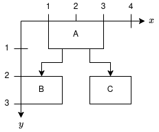
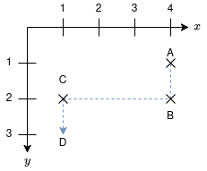
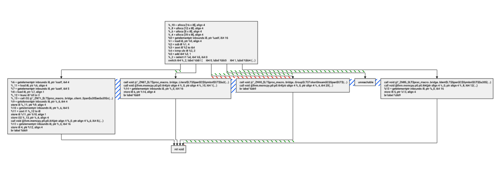

# API

## Architecture

Triskel uses a two step process for its API.

- First, a [builder](#builder) is used to construct the graph (creating nodes, edges, setting node dimensions etc...).
- Then, a [layout](#layout) for the provided graph can be constructed. The layout provides access to information such as a node's coordinates, or an edge's [waypoints](#waypoints).

An optional third step is available: the [renderer](#renderers), it is used to go from coordinates to a visual representation (image or GUI component).

### Coordinate system
{ align=right }

Coordinates, when given as a pair correspond to `(x, y)`. For example `(4, 2)` would be a point with x coordinate 4 and y coordinate 2.

Coordinates in Triskel use floats, and have no units.

Coordinates in Triskel correspond to the coordinates of the **Top Left** corner of an element. For example, in the diagram, the coordinates of `A` would be `(1, 0)` and those of `B` would be `(0, 2)`.

Triskel will always return a graph where the **minimum x and y values are 0**. As you can see in the diagram, the top left corner of the bounding box of the graph is in `(0, 0)`. This means that **all coordinates provided by Triskel are positive**.

### Waypoints

{ align=right }

Triskel models edges as a sequence of segments. This sequence of segments is represented as a list of **waypoints**.

In the diagram, the edge `A -> D` would be represented as the sequence of waypoints `A, B, C, D` (more precisely, using the coordinates `(4, 1), (4, 2), (1, 2), (1, 3)`).

!!! info "Notes"
    - Notice that the order is important, the final coordinate is where the arrow is pointing to.
    - The inner coordinates in the list are used to draw two segments (for example `B` is used for `A-B` and for `B-C`), they are not duplicated.

## Components

### Builder

The builder is used to construct a graph.

It can be built using the `make_layout_builder` method:

=== "C++"
    ``` c++
    auto builder  = triskel::make_layout_builder();
    ```

=== "Python"
    ``` py
    builder = make_layout_builder()
    ```

=== "Java"
    ``` java
    LayoutBuilder builder = jtriskel.make_layout_builder();
    ```

#### Creating nodes

Nodes can be added to the graph with the `make_node` method.

This method can be used to create a node with a given label or with given dimensions.

It returns the id of the created node.

This id is necessary to later access the coordinate of this node, or to create an edge with this node.

!!! warning "Root"
    The first node that is created must be the `root` of the graph.

=== "C++"
    ``` c++
    // Creates a node
    const auto n1  = builder->make_node();

    // Creates a node with a label
    const auto n2  = builder->make_node("label");

    // Creates a node with a given size
    // Here, a width of 1 and a height of 2
    const auto n3  = builder->make_node(1, 2);
    ```

=== "Python"
    ``` py
    # Creates a node
    n1  = builder.make_node()

    # Creates a node with a label
    n2  = builder.make_node("label")

    # Creates a node with a given size
    # Here, a width of 1 and a height of 2
    n3  = builder.make_node(1, 2)
    ```

=== "Java"
    ``` java
    // Creates a node
    long n1 = builder.make_node();

    // Creates a node with a label
    long n2  = builder.make_node("label");

    // Creates a node with a given size
    // Here, a width of 1 and a height of 2
    long n3  = builder.make_node(1, 2);
    ```

#### Creating edges

Edges can be added to the graph with the `make_edge` method.

This method takes the id of the origin and destination nodes, and returns the id of the edge;

=== "C++"
    ``` c++
    // Creates nodes
    const auto n1  = builder->make_node();
    const auto n2  = builder->make_node();

    // Creates an edge
    const auto e  = builder->make_edge(n1, n2);
    ```

=== "Python"
    ``` py
    # Creates nodes
    n1  = builder->make_node()
    n2  = builder->make_node()

    # Creates an edge
    e  = builder->make_edge(n1, n2)
    ```

=== "Java"
    ``` java
    // Creates nodes
    long n1  = builder.make_node();
    long n2  = builder.make_node();

    // Creates an edge
    long e  = builder.make_edge(n1, n2);
    ```

#### Creating the layout

A builder can be used to create a [layout](#layout) using the `build` method.

=== "C++"
    ``` c++
    const auto layout = builder->build();
    ```

=== "Python"
    ``` py
    layout = builder.build()
    ```

=== "Java"
    ``` java
    CFGLayout layout = builder.build();
    ```


!!! warning "Lifetimes"
    Triskel assumes that the builder is destroyed after a call to `build` is performed.


#### Dot notation

Mainly for debug reasons, it is possible to export the graph contained in the builder to [Graphviz](https://www.graphviz.org/)'s dot notation using the method `graphviz`.

=== "C++"
    ``` c++
    // Creates nodes
    const auto n1  = builder->make_node();
    const auto n2  = builder->make_node();

    // Creates an edge
    const auto e  = builder->make_edge(n1, n2);

    // Export the graph to dot notation
    std::cout << builder->graphviz();
    ```

=== "Python"
    ``` py
    # Creates nodes
    n1  = builder.make_node()
    n2  = builder.make_node()

    # Creates an edge
    e  = builder.make_edge(n1, n2)

    # Export the graph to dot notation
    print(builder.graphviz())
    ```

=== "Java"
    ``` java
    // Creates nodes
    long n1  = builder.make_node();
    long n2  = builder.make_node();

    // Creates an edge
    long e  = builder.make_edge(n1, n2);

    // Export the graph to dot notation
    System.out.println(builder.graphviz());
    ```

The expected output for this graph would be:
```
digraph G {
n1
n0
n0 [shape=square]
n0 -> n1
}
```

!!! info "Identifying the root"
    The root of the graph is square for easy identification.

#### Using a renderer

If your nodes have labels, we need to use a [renderer](#renderers) to calculate the size of those nodes. This can be done **after all the nodes are built** using the `measure_nodes` method.

=== "C++"
    ``` c++
    builder->measure_nodes(renderer);
    ```

=== "Python"
    ``` py
    builder.measure_nodes(renderer)
    ```

=== "Java"
    ``` java
    builder.measure_nodes(renderer);
    ```

!!! info "No renderer, no problem"
    If no renderer is provided, Triskel assumes that a character is 1 large and a line is 1 tall.

#### Settings


A couple settings can be changed in the builder:

- `x gutter`: This corresponds to the minimum horizontal distance between two nodes, or a node and a vertical segment. It defaults to 50.
- `y gutter`: This corresponds to the minimum vertical distance between a horizontal segment and a node. It defaults to 40.
- `edge height`: This corresponds to the minimum vertical distance between two horizontal segments. It defaults to 30.



In the diagram, distances determined by:

- `x gutter` are represented in blue.
- `y gutter` are represented in red.
- `edge height` are represented in green.

=== "C++"
    ``` c++
    builder->set_x_gutter(1.0F);
    builder->set_y_gutter(2.0F);
    builder->set_edge_height(3.0F);
    ```

=== "Python"
    ``` py
    builder.set_x_gutter(1.0)
    builder.set_y_gutter(2.0)
    builder.set_edge_height(3.0)
    ```

=== "Java"
    ``` java
    builder.set_x_gutter(1.0F);
    builder.set_y_gutter(2.0F);
    builder.set_edge_height(3.0F);
    ```

### Layout

The layout contains the coordinates necessary to draw the graph.

#### Node coordinates

Using a node's id, you can retrieve its coordinates.

=== "C++"
    ``` c++
    const auto n1 = builder->make_node();
    // [...]
    const auto pt = layout->get_coords(n1);
    std::cout << "x: " << pt.x << " y: " << pt.y;
    ```

=== "Python"
    ``` py
    n1 = builder.make_node()
    # [...]
    pt = layout.get_coords(n1)
    print(f"x: {pt.x} y: {pt.y}")
    ```

=== "Java"
    ``` java
    long n1 = builder.make_node();
    // [...]
    Point pt = layout.get_coords(n1);
    System.out.println("x: " + pt.x + " y: " + pt.y);
    ```

#### Edge waypoints

Using a edge's id, you can retrieve its waypoints.

=== "C++"
    ``` c++
    const auto e = builder->make_edge(n1, n2);
    // [...]
    const auto& waypoints = layout->waypoints(e);
    ```

=== "Python"
    ``` py
    e = builder.make_edge(n1, n2)
    # [...]
    waypoints = layout.get_waypoints(e)
    ```

=== "Java"
    ``` java
    long e = builder.make_edge(n1, n2);
    // [...]
    List<Point> waypoints = layout.get_waypoints(e);
    ```

#### Node dimensions

We can access a node's dimension with the `get_node_height` and `get_node_width` methods.
This is especially important for nodes whose dimensions were calculated by a renderer.

=== "C++"
    ``` c++
    const auto n1 = builder->make_node();
    // [...]
    const auto width = layout->get_node_width(n1);
    const auto height = layout->get_node_height(n1);
    ```

=== "Python"
    ``` py
    n1 = builder.make_node()
    # [...]
    width = layout.get_node_width(n1)
    height = layout.get_node_height(n1)
    ```

=== "Java"
    ``` java
    long n1 = builder.make_node();
    // [...]
    float width = layout.get_node_width(n1);
    float height = layout.get_node_height(n1);
    ```

#### Graph dimensions

We can access the graph's dimension with the `get_height` and `get_width` methods.

=== "C++"
    ``` c++
    const auto width = layout->get_width();
    const auto height = layout->get_height();
    ```

=== "Python"
    ``` py
    width = layout.get_width()
    height = layout.get_height()
    ```

=== "Java"
    ``` java
    float width = layout.get_width();
    float height = layout.get_height();
    ```

### Renderers

Renders are used for drawing a layout. They are used with the `render` or `render_and_save` methods.

The ImGui provides the [ImguiRenderer](#imguirenderer) and Cairo extensions provides the [PNGRenderer](#pngrenderer) and [SVGRenderer](#svgrenderer).

## Other methods

### Version

The function `git_version` allows you to identify which version of Triskel you are using.

=== "C++"
    ``` c++
    triskel::git_version();
    ```

=== "Python"
    ``` py
    git_version()
    ```

=== "Java"
    ``` java
    jtriskel.git_version();
    ```

## Extensions

### Cairo

The Cairo extension provides two renderers for saving layouts to images.

These renderers use the `render_and_save` method.

=== "C++"
    ``` c++
    auto builder  = triskel::make_layout_builder();
    // [...]
    auto renderer = triskel::make_svg_renderer();
    const auto layout   = builder->build();
    layout->render_and_save(*renderer, "./out.svg");
    ```

=== "Python"
    ``` py
    builder  = make_layout_builder();
    # [...]
    renderer = make_svg_renderer();
    layout   = builder->build();
    layout->render_and_save(renderer, "./out.svg");
    ```

=== "Java"
    ``` java
    LayoutBuilder builder  = jtriskel.make_layout_builder();
    // [...]
    ExportingRenderer renderer = jtriskel.make_svg_renderer();
    CFGLayout layout   = builder->build();
    layout->render_and_save(renderer, "./out.svg");
    ```

#### PNGRenderer

The PNG renderer is used to save layouts to PNG images. It is created with the `make_png_renderer` method.

#### SVGRenderer

The SVG renderer is used to save layouts to SVG images. It is created with the `make_svg_renderer` method.
