#

## Theory

<style>
    .theory {
      display: flex;
      align-items: center;
    }

    .half {
      width: 45%;
    }

    .schema {
      display: flex;
      flex-direction: column;
      align-items: center;
      justify-content: center;
      margin-left: auto;
    }

    @media (max-width: 600px) {
     .theory {
      flex-direction: column;
      }

      .half {
        width: 100%;
      }
    }

    .layers {
      position: relative;
      width: 15em;
      aspect-ratio: 0.7;
      perspective: 2000px;
      transform-style: preserve-3d;
      transform: translateX(5em) translateY(3em);
    }

    .layer {
      position: absolute;
      left: 0;
      top: 0;

      width: 15em;
      transform:  rotateX(55deg) rotateY(-20deg) rotateZ(50deg);
      transition: transform 0.5s ease-in-out;
    }

    .layer img {
      position: absolute;
      left: 0;
      top: 0;
      width: 15em;
      transition: opacity 0.5s ease-in-out;
    }

    .z2 {
      transform:  rotateX(55deg) rotateY(-20deg) rotateZ(50deg) translateZ(4em)
    }

    .z3 {
      transform:  rotateX(55deg) rotateY(-20deg) rotateZ(50deg) translateZ(8em)
    }

    .layers:hover .z1 {
      /* transform:  rotateX(55deg) rotateY(-20deg) rotateZ(50deg) translateZ(5em); */
    }

    .layers:hover .z2 {
      transform:  rotateX(55deg) rotateY(-20deg) rotateZ(50deg);
    }

    .layers:hover .z3 {
      transform:  rotateX(55deg) rotateY(-20deg) rotateZ(50deg);
    }

    .layer img.sese {
      opacity: 0;
    }

    .layers:hover .z1 img,
    .layers:hover .z2 img {
       opacity: 0;
    }

    .layers:hover .z1 img.sese,
    .layers:hover .z2 img.sese {
       opacity: 1;
    }
</style>
<div class="theory" markdown>
<div class="half" markdown>

Triskel's layout algorithm is based on a divide and conquer approach using SESE regions.

The graph is split into it's SESE regions, then each region is laid out using Sugiyama Layered graph drawing.

This approach yields graphs with **significantly less** edge crossings and **clearer layouts**.

These results were presented at the [Workshop on Binary Analysis Research 2025](https://www.ndss-symposium.org/ndss2025/co-located-events/bar/) ([paper](https://www.ndss-symposium.org/wp-content/uploads/bar2025-final11.pdf), [presentation](https://www.youtube.com/watch?v=h599P-lArCU&t=1320s&ab_channel=NDSSSymposium&t=22m)).

</div>
<div class="schema">
<div class="layers">
<div class="layer z1">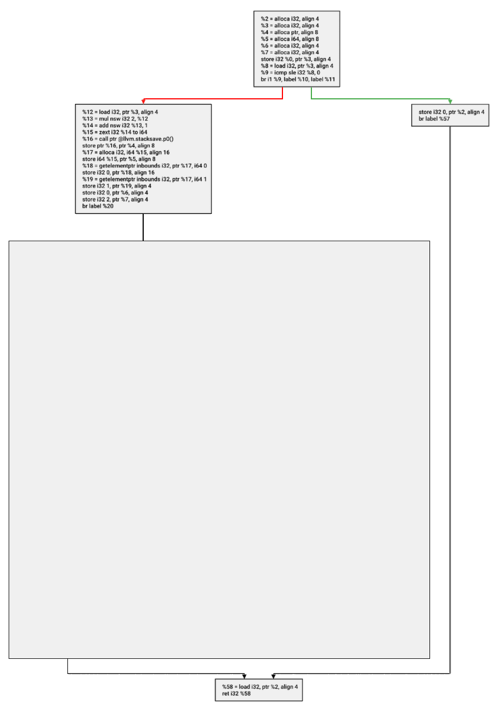</img>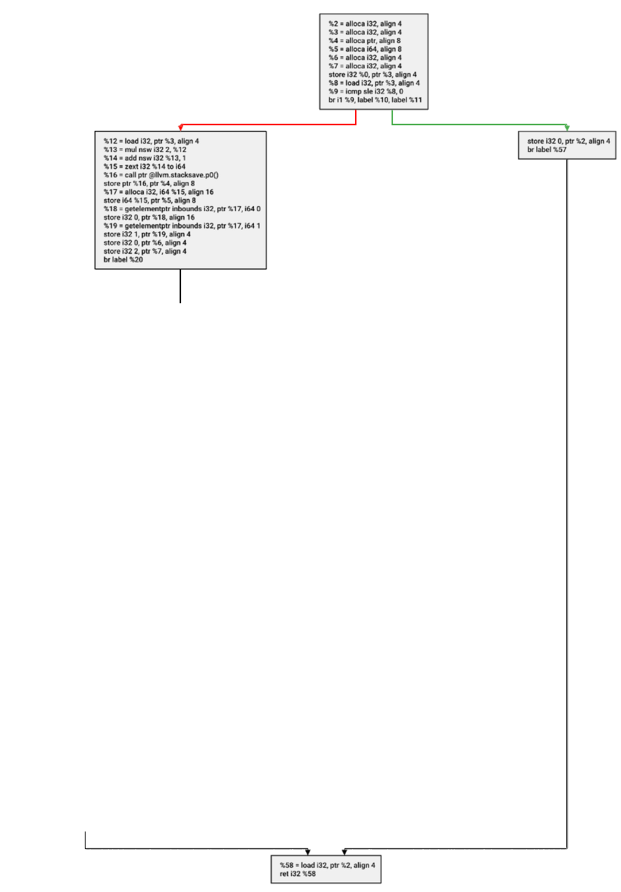</img></div>
<div class="layer z2">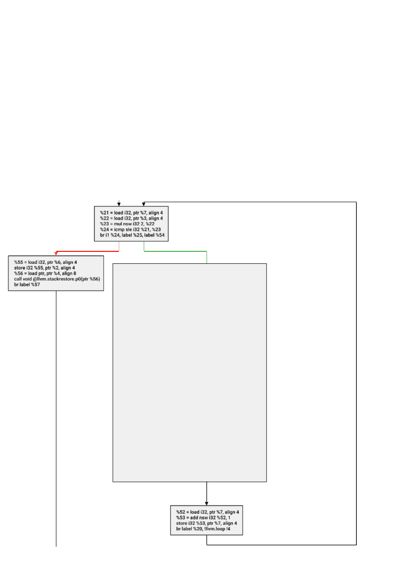</img>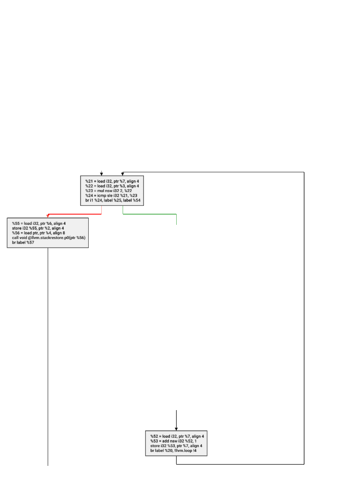</img></div>
<div class="layer z3">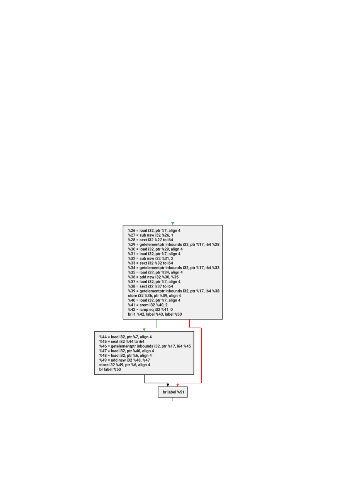</img></div></div>
A flow graph split into SESE regions
</div>
</div>


[:fontawesome-solid-arrow-right: More theory](theory.md)

---

## Screenshots

<div class="carousel">
  <div class="carousel-white"></div>
  <div class="carousel-images" id="carouselImages">
    <div class="carousel-image">
        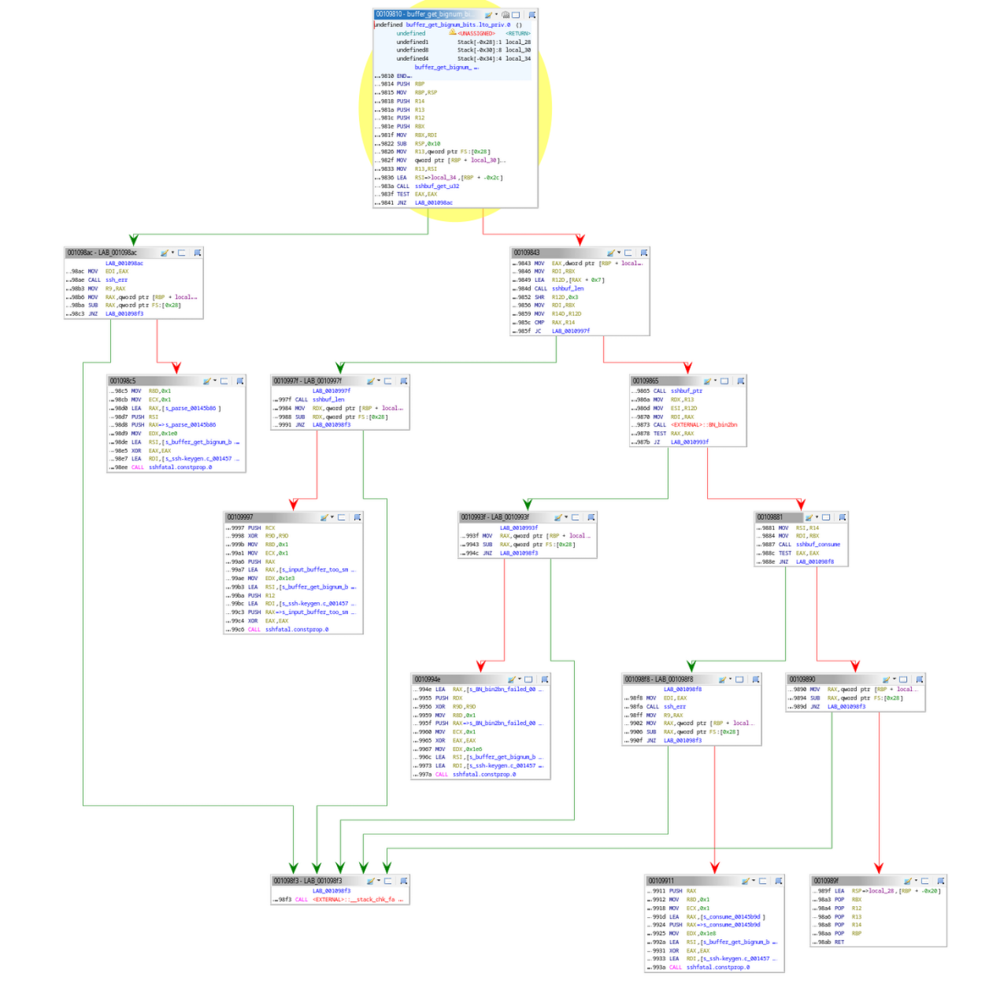
    </div>
    <div class="carousel-image">
        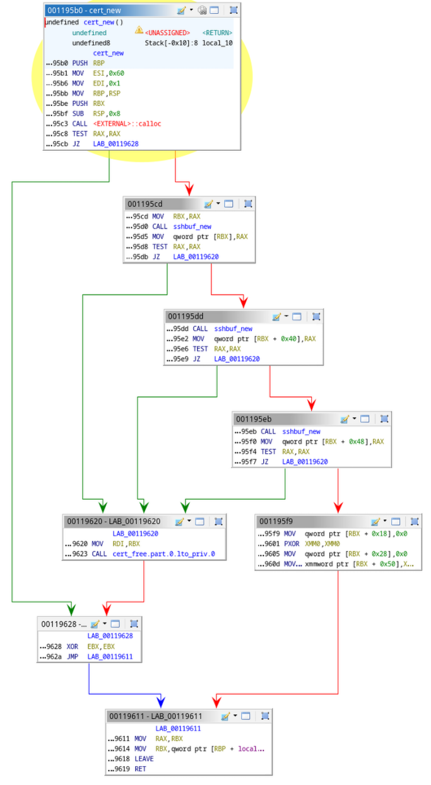
    </div>
    <div class="carousel-image">
        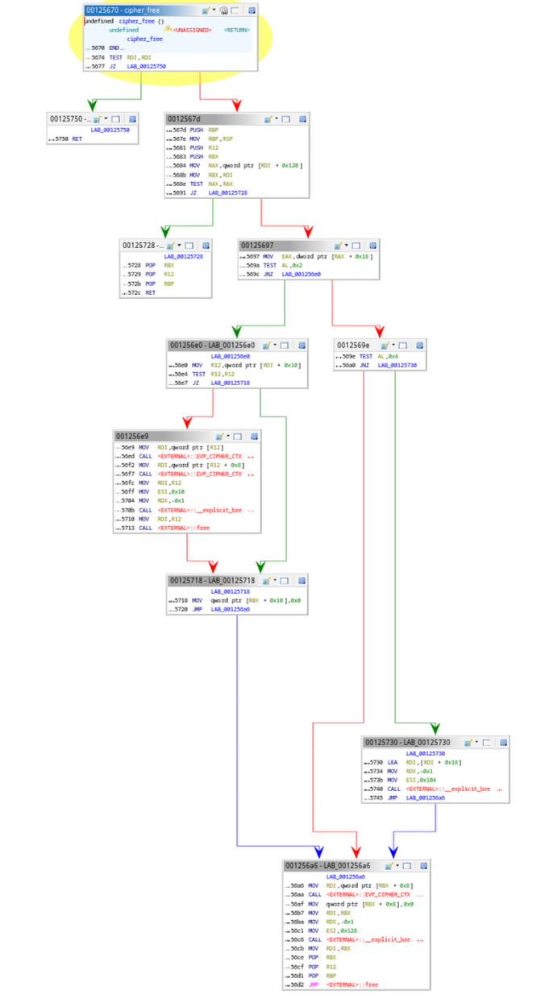
    </div>
    <div class="carousel-image">
        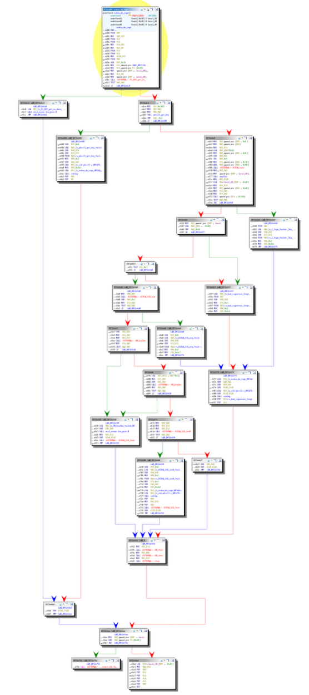
    </div>
    <div class="carousel-image">
        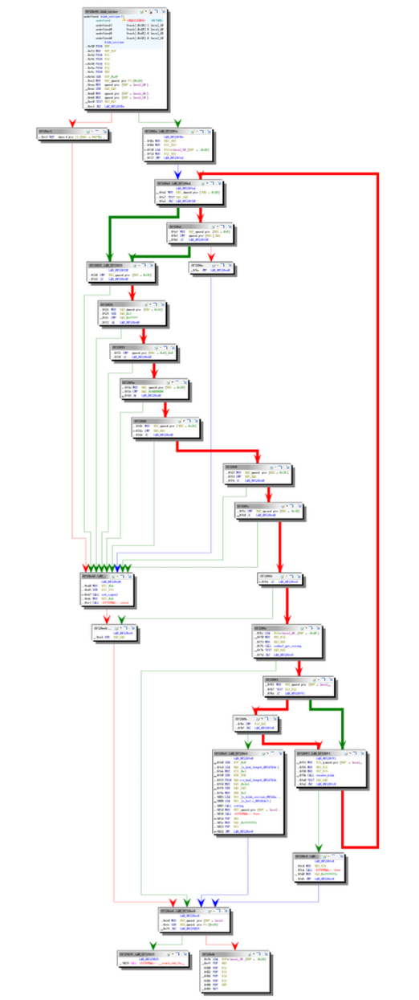
    </div>
    <div class="carousel-image">
        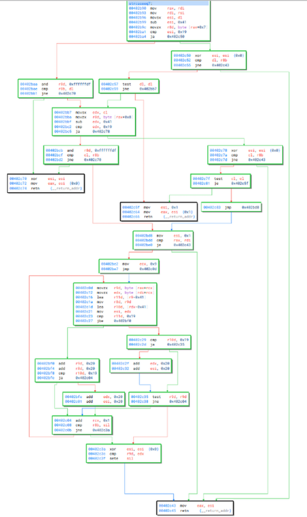
    </div>
    <div class="carousel-image">
        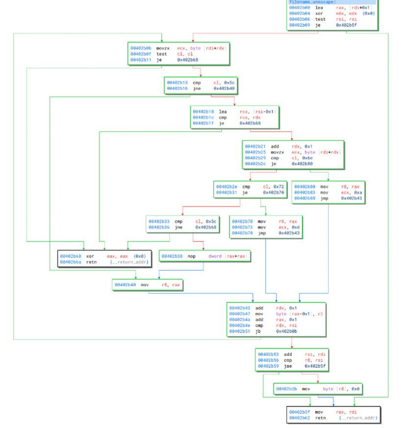
    </div>
    <div class="carousel-image">
        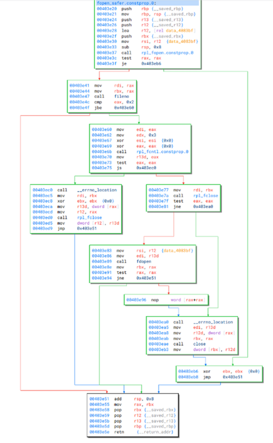
    </div>
    <div class="carousel-image">
        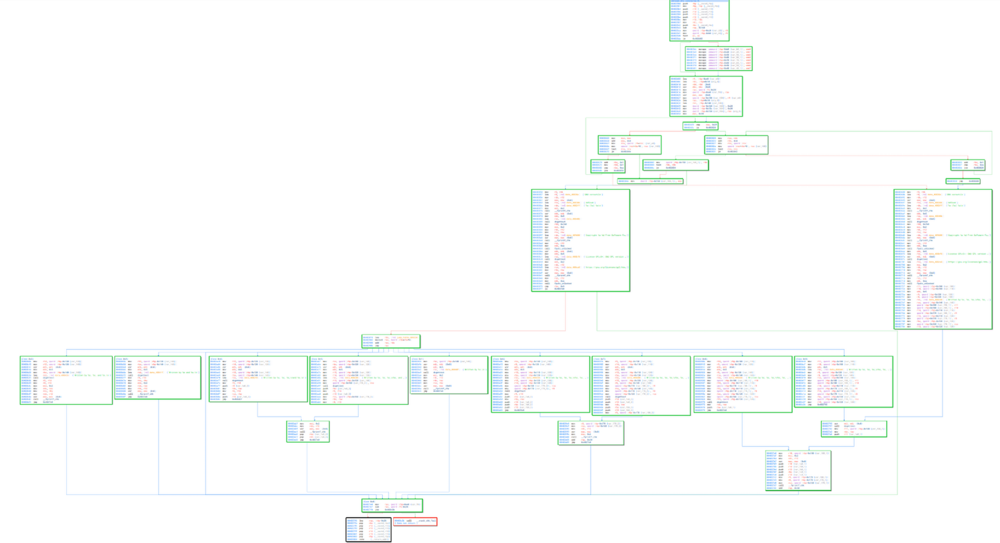
    </div>
    <div class="carousel-image">
        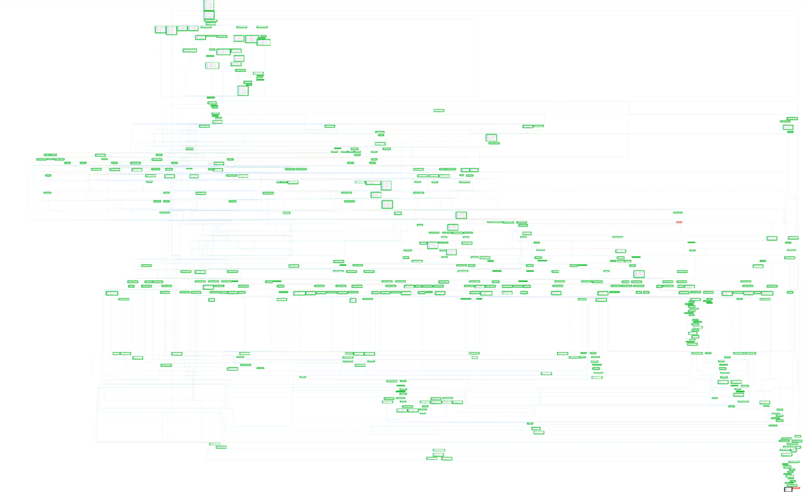
    </div>
  </div>
  <div class="carousel-blue left">
    <button class="nav-button" onclick="prevSlide()">&#10094;</button>
  </div>
  <div class="carousel-blue right">
    <button class="nav-button" onclick="nextSlide()">&#10095;</button>
  </div>
</div>

<script>
  const carousel = document.getElementById('carouselImages');
  const totalSlides = carousel.children.length;
  let index = 0;

  let delay = 3000;

  let timeoutID;

  const updateCarousel = () => {
    clearTimeout(timeoutID);
    carousel.style.transform = `translateX(-${index * carousel.clientWidth}px)`;
  }

  const nextSlide = () => {
    index = (index + 1) % totalSlides;
    updateCarousel();
    timeoutID = setTimeout(nextSlide, delay);
  }

  const prevSlide = () => {
    index = (index - 1 + totalSlides) % totalSlides;
    updateCarousel();
    timeoutID = setTimeout(nextSlide, delay);
  }

  timeoutID = setTimeout(nextSlide, delay);
</script>

---

## Using the API

Triskel includes an easy to use API for drawing flow graphs in your applications.

It's available for:

- [C++](quickstart.md#c)
- [Python](quickstart.md#python)
- [Java](quickstart.md#java)


=== "C++"
    ``` c++
    #include <triskel/triskel.hpp>

    int main(void) {
        auto builder  = triskel::make_layout_builder();

        const auto n1 = builder->make_node("Hello");
        const auto n2 = builder->make_node("World");
        builder->make_edge(n1, n2)

        auto renderer = triskel::make_svg_renderer();
        builder->measure_nodes(renderer)
        const auto layout   = builder->build();

        layout->render_and_save(*renderer, "./out.svg");

        return 0;
    }
    ```

=== "Python"
    ``` py
    from pytriskel.pytriskel import *

    builder = make_layout_builder()

    # Build the graph
    n1 = builder.make_node("Hello")
    n2 = builder.make_node("World")
    builder.make_edge(n1, n2)

    # Measure node size using font size
    png_renderer = make_png_renderer()
    builder.measure_nodes(png_renderer)

    # Export an image
    layout = builder.build()
    layout.save(png_renderer, "out.png")
    ```

=== "Java"
    ``` java
    import jtriskel.*;

    public class Main {
        static {
            System.loadLibrary("jtriskel");
        }

        public static void main(String[] args) {
            try {
                LayoutBuilder builder = jtriskel.make_layout_builder();
                ExportingRenderer png_renderer = jtriskel.make_png_renderer();

                long n1 = builder.make_node("Hello");
                long n2 = builder.make_node("World");

                long e = builder.make_edge(n1, n2);

                builder.measure_nodes(png_renderer);
                CFGLayout layout = builder.build();
                builder.delete();

                layout.render_and_save_s(png_renderer, "./out.png");
            }
            catch (Exception e) {
                e.printStackTrace();
            }
        }
    }
    ```

[:fontawesome-solid-arrow-right: API](api.md)

---

## Get in touch

[:simple-discord: Join our discord](https://discord.gg/zgBb5VUKKS){ .md-button }
