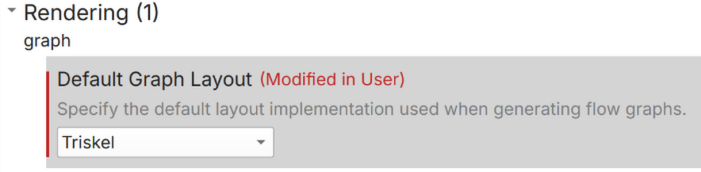
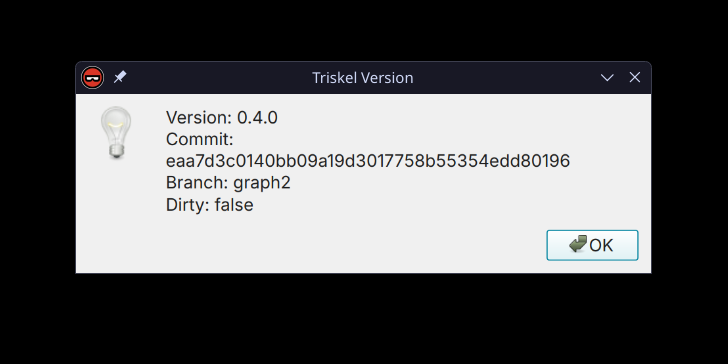
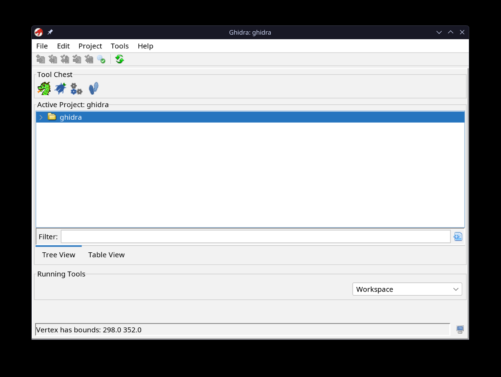
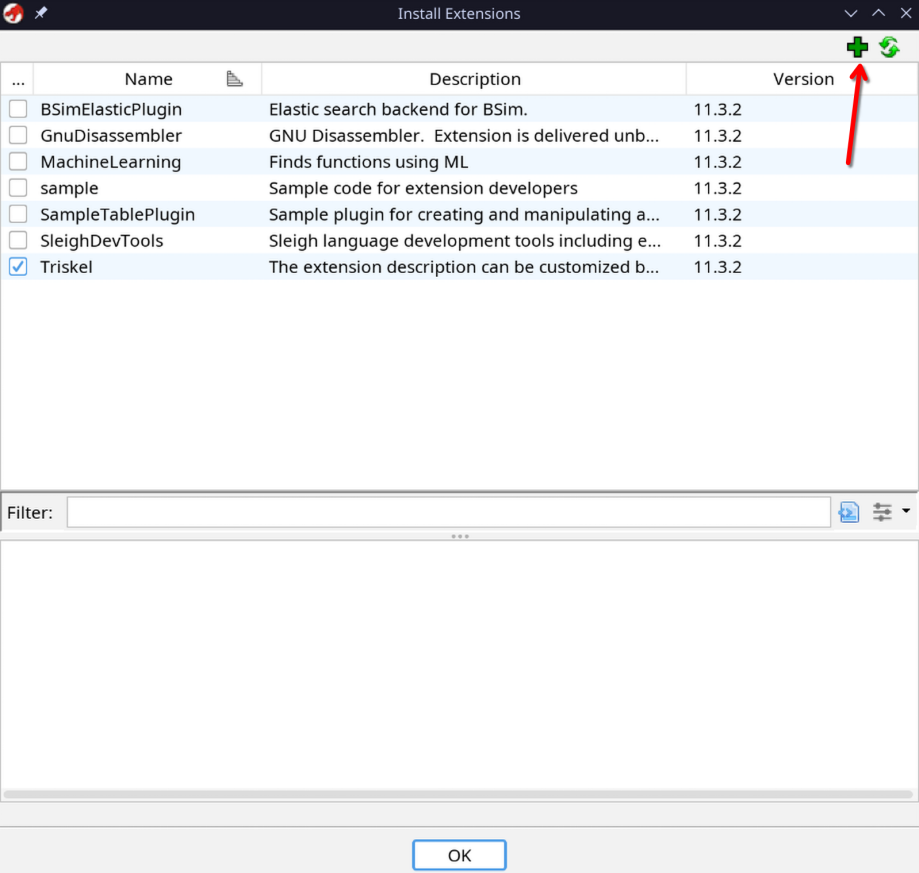
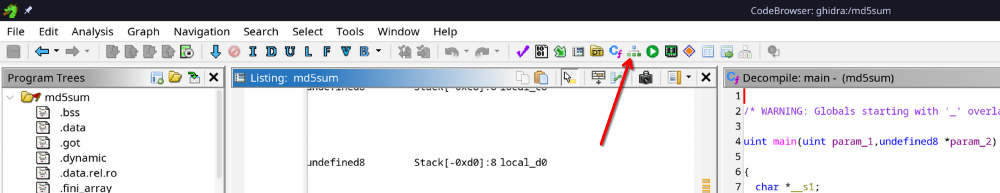
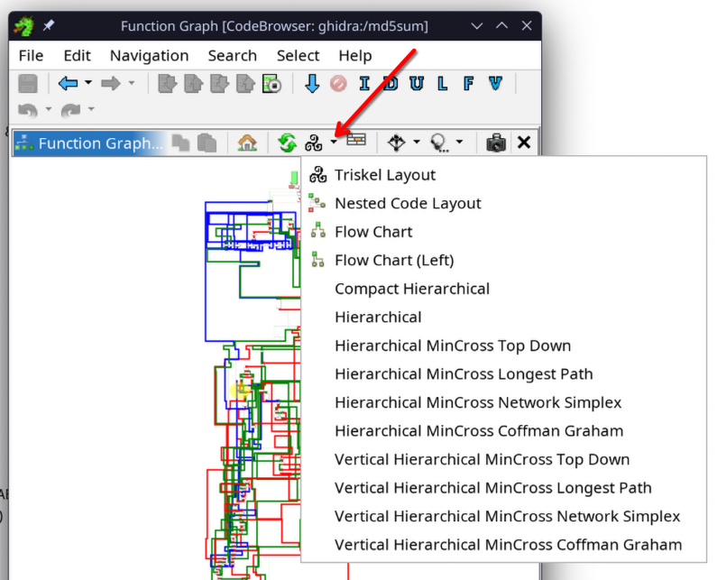

We integrated Triskel into binary analysis engines.

!!! warning "Limitation"
    The current plugin implementation do not perform any checks on the graph size which can lead to freezes / crashes.

!!! example "WIP"

    ## Binary Ninja

    ### Screenshots

    

    

    

        

            
        

        

            
        

        

            
        

        

            
        

        

            
        

    

    

        <button class="nav-button" onclick="prevSlide(0)">&#10094;</button>
    

    

        <button class="nav-button" onclick="nextSlide(0)">&#10095;</button>
    

    

    ### Installation

    This plugin is currently unavailable to the public!

    ### Usage

    #### Changing the layout engine

    To pick the new layout engines provided by Triskel, go to
    `Edit > Settings > Rendering > graph > Default Graph Layout`, and switch the engine to Triskel.

    

    #### Options

    Triskel's layout comes with different compactness options to suit your personal preference. These options only change spacing between blocks.

    ### Reporting a bug

    You can access Triskel's build information for reporting a bug by going to
    `Plugins > Triskel Version`.

    

    !!! tip "Shout out"
        Huge shout out to Binary Ninja for being very helpful!

## Ghidra

### Screenshots

  

  

    

        
    

    

        
    

    

        
    

    

        
    

    

        
    

  

  

    <button class="nav-button" onclick="prevSlide(1)">&#10094;</button>
  

  

    <button class="nav-button" onclick="nextSlide(1)">&#10095;</button>
  

### Installation

Go to the [ghidra extension repo](https://github.com/triskellib/ghidra), and download the [latest release](https://github.com/triskellib/ghidra/releases/download/v0.3.1/ghidra_11.3.2_PUBLIC_20250512_Triskel.zip).

You can then install it like a regular Ghidra extension

??? info "Installing a Ghidra Extension"
    When starting Ghidra, Go to `File > Install Extension`.
    

    Then click on the green plus at the top left and select the downloaded zip.
    

    Finally, restart Ghidra.

### Usage

Start by opening a function's graph view.

#### Changing the layout engine

On the dropdown to select a layout engine, select Triskel.

